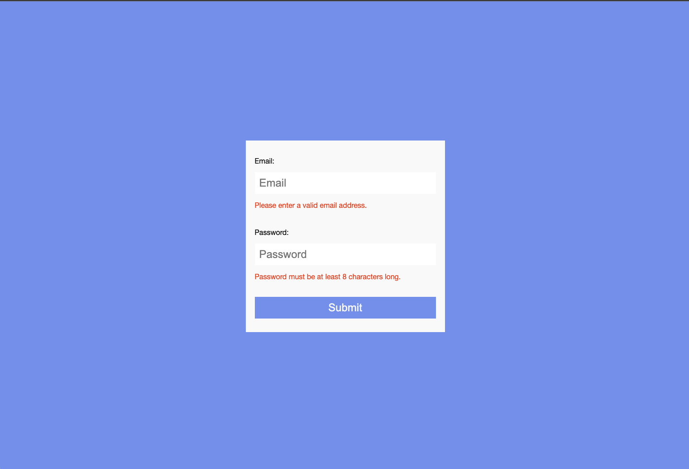
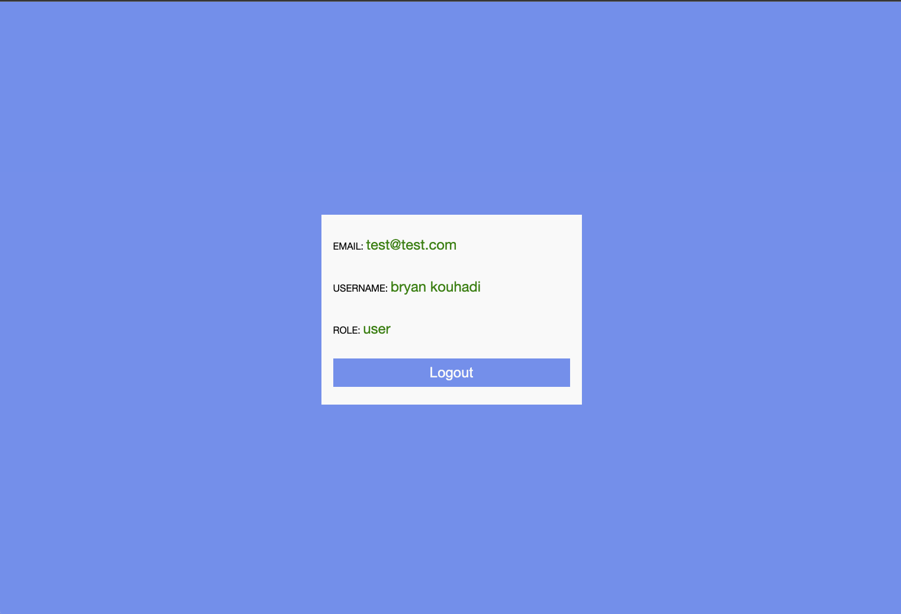

# DESCRIPTION: an authentication service using Go-chi and Jwt.

- THis application is build in Go, Go-chi and jwt + Reactjs for the client side.
- Jwt tokens are being stored in httpOnly cookies after being encrypted with AES-GCM.
- When the access token is expired, it gets automatically refereshed by the middleware if the refersh token is still not expired.

# INSTRUCTIONS:

- Add an .env file in `server` directory and add: SECRET_JWT_KEY="your secret key" & AES_SECRECT_KEY="Your secret key"
- To run the frontend: make frontend
- To run the backend: make backend

# SCREENSHOTS:

Login page:

Profile page:

